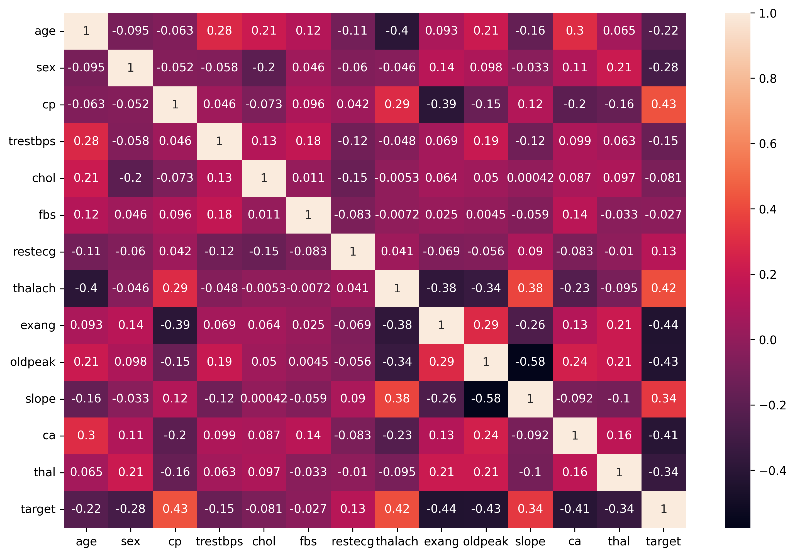

# ❤️ Heart Disease Prediction using Machine Learning

## 📌 Overview

This project focuses on predicting the presence of heart disease using Machine Learning classification algorithms.

The project uses a Heart Disease dataset containing various medical and clinical features such as age, sex, chest pain type, resting blood pressure, cholesterol, maximum heart rate, and other health-related attributes.

Two Machine Learning algorithms are implemented and compared:

- Logistic Regression
- Decision Tree Classifier

The models are evaluated using accuracy, classification reports, and confusion matrices.

---

## 🎯 Objectives

The main objectives of this project are:

- Analyze the Heart Disease dataset.
- Perform Exploratory Data Analysis (EDA).
- Study the correlation between different features.
- Remove duplicate records.
- Separate input features and target variable.
- Split the dataset into training and testing sets.
- Apply feature scaling where required.
- Train Logistic Regression and Decision Tree models.
- Evaluate both models.
- Compare their performance.
- Determine which model performs better on the given dataset.

---

## 📊 Dataset

The dataset used in this project is:

`heart.csv`

The dataset contains the following features:

| Feature | Description |
|--------|-------------|
| age | Age of the patient |
| sex | Sex of the patient |
| cp | Chest pain type |
| trestbps | Resting blood pressure |
| chol | Serum cholesterol |
| fbs | Fasting blood sugar |
| restecg | Resting electrocardiographic results |
| thalach | Maximum heart rate achieved |
| exang | Exercise-induced angina |
| oldpeak | ST depression induced by exercise |
| slope | Slope of the peak exercise ST segment |
| ca | Number of major vessels |
| thal | Thalassemia-related feature |
| target | Target variable indicating heart disease |

The `target` column is the variable that the Machine Learning models try to predict.

---

## 🔎 Exploratory Data Analysis

Exploratory Data Analysis was performed to understand the dataset before training the models.

The analysis includes:

- Dataset inspection
- Statistical analysis
- Missing value checking
- Duplicate value checking
- Target distribution
- Feature distribution
- Correlation analysis

### Correlation Heatmap

A correlation heatmap was created to visualize the relationship between different features and the target variable.



The heatmap helps identify which features have stronger positive or negative relationships with the target.

---

## 🧹 Data Preprocessing

Before training the Machine Learning models, the dataset was preprocessed.

### Removing Duplicate Records

Duplicate records were identified and removed from the dataset.

```python
df = df.drop_duplicates()
